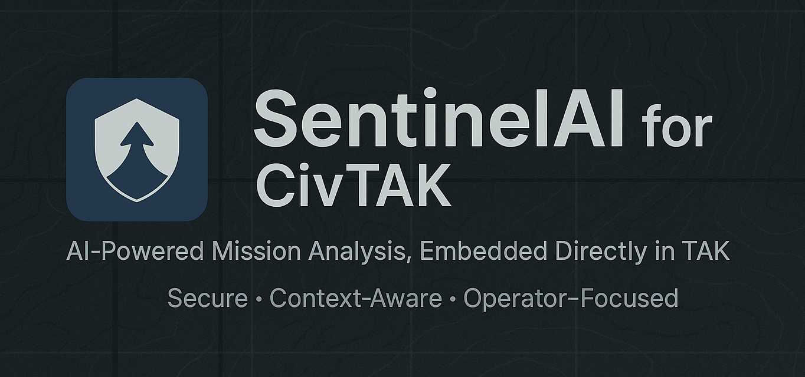

<p align="center">
  
</p>

# SentinelAI for CivTAK

**AI-powered mission analysis, embedded directly in CivTAK.**

SentinelAI is an Android plugin for CivTAK that delivers fast, structured, AI-assisted mission analysis inside the TAK environment. It enables operators and analysts to ask natural-language questions about an operational context and receive concise summaries, risks, and actionable recommendations — without leaving CivTAK.

---

## Why SentinelAI

Modern missions generate more data than a human can synthesize in real time. SentinelAI acts as an analysis copilot, turning mission context into clarity.

- Reduce cognitive load during operations
- Surface risks early
- Provide structured, explainable outputs
- Keep sensitive workflows off the device and under your control

---

## Key Capabilities

- **Mission Analysis Panel**
  - Ask free-form questions about a mission
  - Chat-style history of analysis requests and responses

- **Context-Aware Requests**
  - Time window selection
  - Location and signal context
  - Mission notes and metadata

- **Clear Outputs**
  - Intent classification
  - Executive summary
  - Risk list
  - Actionable recommendations

- **Secure by Design**
  - No AI models or credentials embedded in the APK
  - Plugin communicates only with a backend service you control
  - Suitable for on-prem or controlled cloud deployments

---

## Architecture Overview

```
CivTAK (Android Plugin)
        |
        | HTTPS (JSON)
        v
SentinelAI Backend (FastAPI)
        |
        | AI / Analysis Engine
        v
Structured Mission Intelligence
```

- **Android plugin**: UI, configuration, context collection
- **Backend service**: AI orchestration, policy enforcement, model integration

---

## Development & Testing

### Standalone App Mode
The plugin can run as a standard Android app for development and testing.

- Works on Android emulators
- No CivTAK installation required (may not be supported anyway)
- Ideal for UI, networking, and backend validation

### CivTAK Plugin Mode
- Install alongside CivTAK on a real device
- Plugin UI integrates into CivTAK menus
- Context hooks (markers, map extent) enabled when running in-host

---

## Configuration

All configuration is managed locally on the device via the SentinelAI Settings screen:

- Backend URL
- API key
- Request timeout
- Debug logging toggle

No configuration is hard-coded into the application.

---

## Security Model

- No direct LLM access from the device
- All requests are routed through a backend you own
- No sensitive mission data is persisted by default
- Designed to support air-gapped or restricted environments

---

## Technology Stack

### Android Plugin
- Kotlin
- AndroidX
- OkHttp
- Coroutines
- Moshi / Gson

### Backend
- Python
- FastAPI
- Pydantic
- Provider-agnostic AI integration

---

## Status

SentinelAI is currently in **active development** and suitable for:

- Technical demos
- Internal evaluations
- Controlled pilot deployments

---

## License

Apache License 2.0

Licensed under the Apache License, Version 2.0. See [LICENSE](LICENSE) for details.

---

## Contact

For demos, integration discussions, or questions, contact:

**SentinelAI Team**
